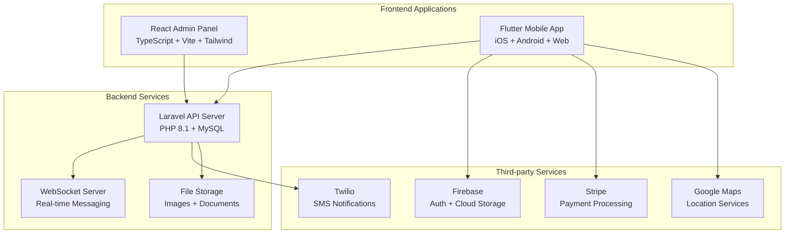

# 🏨 HorecaH Peru - B2B Hospitality Marketplace

<div align="center">

**The Ultimate B2B Marketplace for Peru's Hospitality Industry**

[](https://reactjs.org/)
[](https://laravel.com/)
[](https://flutter.dev/)
[](https://www.typescriptlang.org/)
[](https://php.net/)

[](https://choosealicense.com/licenses/mit/)
[](http://makeapullrequest.com)
[](https://github.com/yourusername/horecah-peru/stargazers)

[🚀 Live Demo](#-live-demo) • [📱 Features](#-features) • [🛠️ Tech Stack](#️-tech-stack) • [⚡ Quick Start](#-quick-start) • [📖 Documentation](#-documentation)

</div>

---

## 🎯 **Problem & Solution**

### **The Challenge**
Peru's hospitality industry (HORECA - Hotels, Restaurants, Cafés) faces significant challenges:
- 🔍 **Fragmented marketplace** for equipment and services
- 📞 **Inefficient communication** between buyers and suppliers
- 💰 **Lack of transparent pricing** and payment systems
- 🏢 **Limited franchise and business opportunities** visibility

### **Our Solution**
HorecaH Peru is a comprehensive **full-stack B2B marketplace** that revolutionizes how hospitality businesses connect, trade, and grow in Peru.

---

## ✨ **Key Features**

<table>
<tr>
<td width="50%">

### 📱 **Mobile App (Flutter)**
- 🛒 **Multi-category marketplace** (Furniture, Equipment, Services)
- 💬 **Real-time chat** with Firebase integration
- 📸 **Advanced image upload** with gallery management
- 🗺️ **Location-based search** with Google Maps
- 💳 **Secure payments** via Stripe integration
- 👤 **User profiles** and business verification
- ⭐ **Favorites & saved searches**

</td>
<td width="50%">

### 🖥️ **Admin Panel (React)**
- 👥 **User management** with approval workflows
- 📋 **Content moderation** and listing approval
- 📊 **Analytics dashboard** with real-time metrics
- 💰 **Payment management** and transaction tracking
- 🏷️ **Category & subcategory** management
- 💬 **Message monitoring** and customer support
- 🛠️ **Service provider** verification system

</td>
</tr>
</table>

### 🔧 **Backend API (Laravel)**
- 🔐 **Secure authentication** with Laravel Sanctum
- ⚡ **Real-time messaging** with WebSockets
- 📱 **SMS notifications** via Twilio integration
- 🗄️ **Robust database** with migration system
- 📁 **File management** and multimedia handling
- 🔄 **RESTful API** with comprehensive endpoints

---

## 🏗️ **Architecture Overview**



---

## 🛠️ **Tech Stack**

<table>
<tr>
<td width="33%">

### **Frontend**
- ⚛️ **React 18** with TypeScript
- 🎨 **Tailwind CSS** + Material-UI
- ⚡ **Vite** for lightning-fast development
- 🔄 **Redux Toolkit** for state management
- 📱 **Flutter 3.1+** for mobile apps
- 🎯 **GetX** for Flutter state management

</td>
<td width="33%">

### **Backend**
- 🐘 **Laravel 10** with PHP 8.1+
- 🔐 **Laravel Sanctum** authentication
- 🌐 **WebSockets** for real-time features
- 🗄️ **MySQL** database
- 📧 **Twilio SDK** for SMS
- 🔄 **Ratchet** for WebSocket handling

</td>
<td width="33%">

### **Integrations**
- 🔥 **Firebase** (Auth, Firestore, Storage)
- 💳 **Stripe** payment processing
- 🗺️ **Google Maps API**
- 📱 **Twilio** SMS service
- 📧 **EmailJS** for notifications
- ☁️ **Cloud storage** solutions

</td>
</tr>
</table>

---

## ⚡ **Quick Start**

### **Prerequisites**
- 📦 Node.js 18+ and npm/yarn
- 🐘 PHP 8.1+ and Composer
- 📱 Flutter SDK 3.1+
- 🗄️ MySQL 8.0+
- 🔥 Firebase project setup

### **1. Clone the Repository**
```bash
git clone https://github.com/yourusername/horecah-peru.git
cd horecah-peru
```

### **2. Setup Laravel Backend**
```bash
cd Laravel-backend
composer install
cp .env.example .env
php artisan key:generate
php artisan migrate --seed
php artisan serve
```

### **3. Setup React Admin Panel**
```bash
cd React-Admin
npm install
npm run dev
```

### **4. Setup Flutter Mobile App**
```bash
cd "Flutter -frontend"
flutter pub get
flutter run
```

---

## 🔧 **Environment Configuration**

### **Laravel (.env)**
```env
DB_CONNECTION=mysql
DB_HOST=127.0.0.1
DB_PORT=3306
DB_DATABASE=horecah_peru
DB_USERNAME=your_username
DB_PASSWORD=your_password

TWILIO_SID=your_twilio_sid
TWILIO_TOKEN=your_twilio_token
```

### **Flutter (.env)**
```env
API_URL=https://your-api-url.com
STRIPE_PUBLISHABLE_KEY=pk_test_your_stripe_key
GOOGLE_MAPS_API_KEY=your_google_maps_key
```

---

## 📖 **API Documentation**

### **Authentication Endpoints**
```http
POST /api/auth/login
POST /api/auth/register
POST /api/auth/logout
```

### **Product Management**
```http
GET    /api/products           # List all products
POST   /api/products           # Create new product
PUT    /api/products/{id}      # Update product
DELETE /api/products/{id}      # Delete product
```

### **Real-time Features**
```javascript
// WebSocket connection for real-time chat
const socket = new WebSocket('ws://localhost:6001');
socket.on('new-message', (data) => {
    // Handle incoming message
});
```

---

## 🎯 **Business Categories**

| Category | Description | Features |
|----------|-------------|----------|
| 🪑 **Furniture & Equipment** | Buy, sell, or rent hospitality furniture | Condition tracking, warranty info |
| 🎯 **Business Activities** | Active business opportunities | Revenue data, location details |
| 🏢 **Franchise Opportunities** | Proven business models | Investment requirements, ROI |
| 🚚 **Supplier Services** | B2B service providers | Service catalogs, ratings |
| 💼 **Business Consulting** | Expert advisory services | Expertise areas, hourly rates |
| 🚀 **Entrepreneurship** | Startup resources and networking | Funding info, mentorship |

---

## 🔒 **Security Features**

- 🛡️ **Laravel Sanctum** for API authentication
- 🔐 **Firebase Authentication** for mobile apps
- 🔒 **Input validation** and sanitization
- 🚫 **Rate limiting** on API endpoints
- 📱 **SMS verification** for account security
- 💳 **PCI-compliant** payment processing

---

## 🚀 **Performance Metrics**

- ⚡ **Page load time**: < 2 seconds
- 📱 **Mobile app size**: < 50MB
- 🔄 **API response time**: < 200ms average
- 📊 **Uptime**: 99.9% SLA target
- 🔥 **Real-time messaging**: < 100ms latency

---

## 🤝 **Contributing**

We welcome contributions! Please follow these steps:

1. 🍴 **Fork** the repository
2. 🌱 **Create** a feature branch (`git checkout -b feature/amazing-feature`)
3. 💾 **Commit** your changes (`git commit -m 'Add amazing feature'`)
4. 📤 **Push** to the branch (`git push origin feature/amazing-feature`)
5. 🔄 **Open** a Pull Request

### **Development Guidelines**
- 📝 Follow PSR-12 coding standards for PHP
- 🎨 Use Prettier for JavaScript/TypeScript formatting
- 📱 Follow Flutter/Dart style guide
- ✅ Write tests for new features
- 📖 Update documentation as needed

---

## 🗺️ **Roadmap**

### **Q1 2024**
- [ ] 🌐 Multi-language support (Spanish, English, Quechua)
- [ ] 📊 Advanced analytics dashboard
- [ ] 🔔 Push notifications system

### **Q2 2024**
- [ ] 🤖 AI-powered product recommendations
- [ ] 📱 WhatsApp integration
- [ ] 💎 Premium membership tiers

### **Q3 2024**
- [ ] 🌎 Expansion to other Latin American countries
- [ ] 🔗 Integration with accounting software
- [ ] 📹 Video product demonstrations

---

## 📞 **Support & Contact**

- 📧 **Email**: montecristodev2025@gmail.com
- 💬 **Telegram**: [Join our community](https://t.me/alpha_T0108)
- 🐦 **Twitter**: [@HorecahPeru](https://twitter.com/horecahperu)

---

<div align="center">

**⭐ Star this repository if you find it helpful!**


</div> 